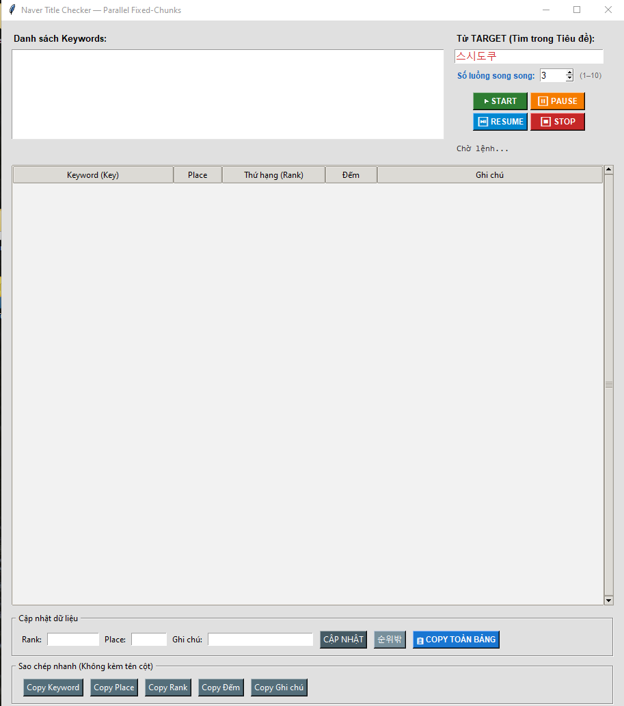
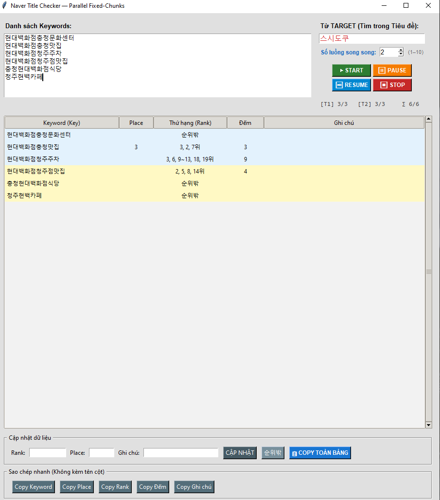

# 🔍 Naver Title Checker — Parallel 3 Threads

Tool kiểm tra thứ hạng từ khoá trên **Naver Search** tự động bằng Selenium.  
Chạy **3 trình duyệt Chrome song song**, phát hiện cả kết quả **Place (bản đồ)** lẫn **tiêu đề bài viết**.

---

## 📸 Giao diện

**Khởi động:**



**Sau khi quét xong:**



---

## ✨ Tính năng chính

- **Quét song song 3 luồng** — 3 Chrome chạy cùng lúc, nhanh hơn ~3x so với quét tuần tự
- **Tìm Rank tiêu đề** — phát hiện vị trí xuất hiện của từ TARGET trong các tiêu đề kết quả tìm kiếm Naver
- **Tìm Rank Place** — phát hiện thứ hạng trên khối Naver Place (địa điểm / bản đồ)
- **Highlight trực tiếp** — tô vàng tiêu đề chứa TARGET ngay trên trình duyệt, viền đỏ kết quả đầu tiên
- **Nén dãy liên tiếp** — hiển thị gọn `1, 3, 5~9위` thay vì liệt kê từng số
- **Status bar tiến độ** — hiển thị `✅ Tiến độ: X/Y` theo thời gian thực
- **Pause / Resume / Stop** — kiểm soát quá trình quét bất cứ lúc nào
- **Copy linh hoạt** — copy từng cột riêng hoặc toàn bộ bảng

---

## 🖥️ Giao diện ứng dụng

### Phần nhập liệu
| Thành phần | Mô tả |
|---|---|
| **Danh sách Keywords** | Nhập từng keyword một dòng |
| **Từ TARGET** | Từ cần tìm trong tiêu đề (mặc định: `스시도쿠`) |
| **Số luồng song song** | Cố định 3 luồng |

### Nút điều khiển
| Nút | Chức năng |
|---|---|
| ▶ START | Bắt đầu quét |
| ⏸ PAUSE | Tạm dừng |
| ⏯ RESUME | Tiếp tục |
| ⏹ STOP | Dừng hẳn |

### Bảng kết quả
| Cột | Ý nghĩa |
|---|---|
| **Keyword** | Từ khoá đã quét |
| **Place** | Thứ hạng trên Naver Place |
| **Rank** | Vị trí xuất hiện trong tiêu đề (vd: `2, 5~8위`) |
| **Đếm** | Tổng số lần xuất hiện |
| **Ghi chú** | Ghi chú thủ công |

> `순위밖` = không xuất hiện trong kết quả tìm kiếm

---

## ⚙️ Cài đặt

**Yêu cầu:** Python 3.8+ và Google Chrome đã cài sẵn.

```bash
pip install selenium webdriver-manager
```

---

## 🚀 Cách chạy

```bash
python main_v3.py
```

1. Nhập danh sách **Keywords** vào ô bên trái (mỗi từ 1 dòng)
2. Nhập **từ TARGET** cần tìm vào ô bên phải
3. Nhấn **▶ START** — 3 Chrome sẽ tự động mở và bắt đầu quét
4. Theo dõi kết quả cập nhật trực tiếp trên bảng
5. Dùng nút **Copy** để lấy dữ liệu khi xong

---

## 🔧 Tuỳ chỉnh

Mở file, chỉnh dòng đầu để thay đổi số luồng:

```python
NUM_THREADS = 3  # giảm xuống 2 nếu máy yếu RAM
```

---

## 📁 Cấu trúc thư mục

```
📦 project/
├── x_ssongssong1.py     # File chính
├── README.md
└── images/
    ├── Start_Img.png    # Ảnh giao diện lúc khởi động
    └── End_Img.png      # Ảnh sau khi quét xong
```
