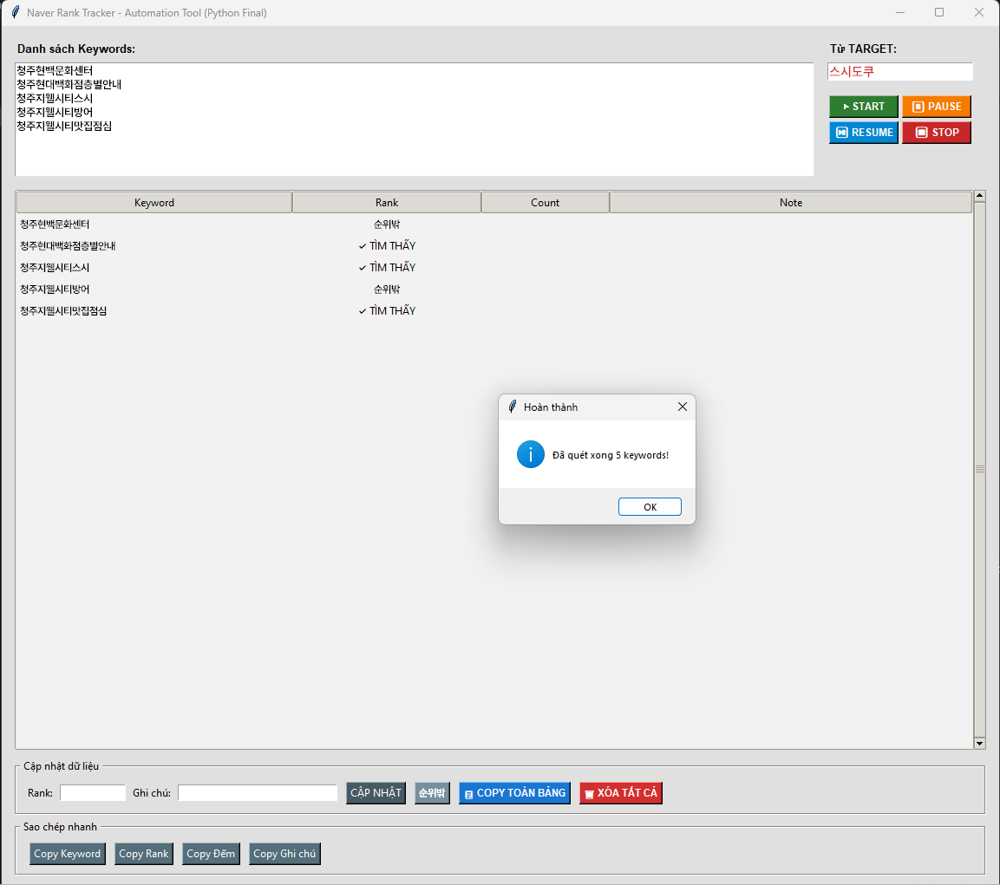
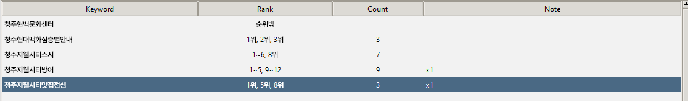

# Naver Rank Tracker (Automation Tool)

A multi-threaded Desktop Application built with Python, Tkinter, and Selenium to automate the tracking and visual highlighting of specific target keywords across Naver Search Engine results.

## 📸 Application Demo

### Main Interface & Setup
*(The interface allows users to input multiple keywords, set the target string, and control the automation flow)*


### Execution & Live Tracking
*(Real-time scraping process with thread-safe UI updates and DOM Javascript injection)*


## 🛠 Technical Highlights

* **Separation of Concerns (SoC):** Project structure strictly separates GUI management (`main.py`) from business/scraping logic (`scraper.py`).
* **Thread-Safe UI Updates:** Utilizes `threading` and `root.after()` callback mechanisms to prevent GUI freezing during intensive Selenium web scraping operations.
* **Javascript DOM Injection:** Optimizes the searching process by injecting vanilla Javascript into the client's browser to execute visual highlighting (yellow background, bold, border) and smooth scrolling, drastically reducing DOM traversal latency compared to pure Selenium parsing.
* **Anti-Bot Bypass:** Implements stealth flags (`--disable-blink-features=AutomationControlled`) to prevent detection blocks from Naver.
* **Regex Data Parsing:** Implements regular expressions to parse complex string patterns (e.g., "1~5위", "1, 3, 5") and dynamically calculate accurate occurrence counts directly within the grid.

## 📂 Project Structure

```text
├── main.py              # Entry point: Tkinter GUI and Thread management
├── scraper.py           # Core logic: Selenium WebDriver and JS injection
├── requirements.txt     # Python dependencies
└── images/              # Documentation assets