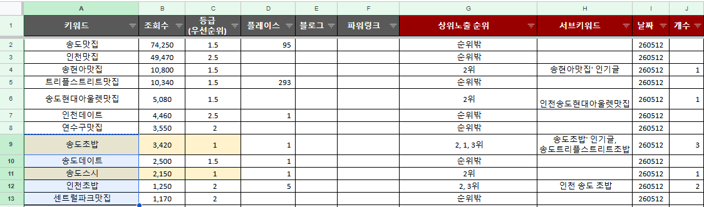
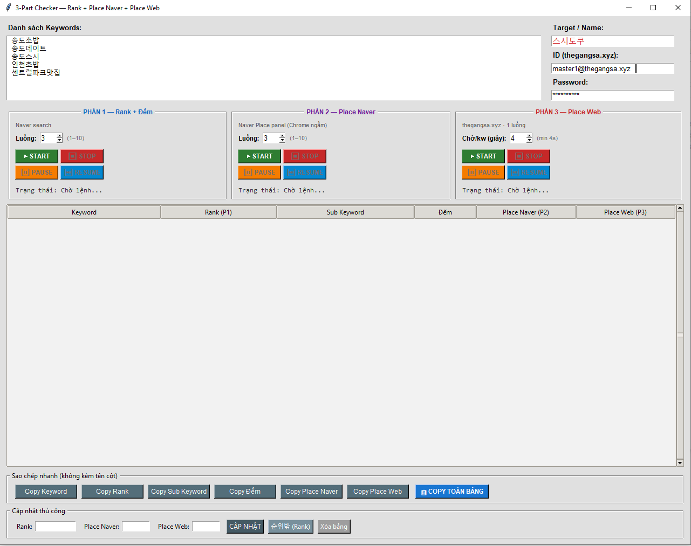
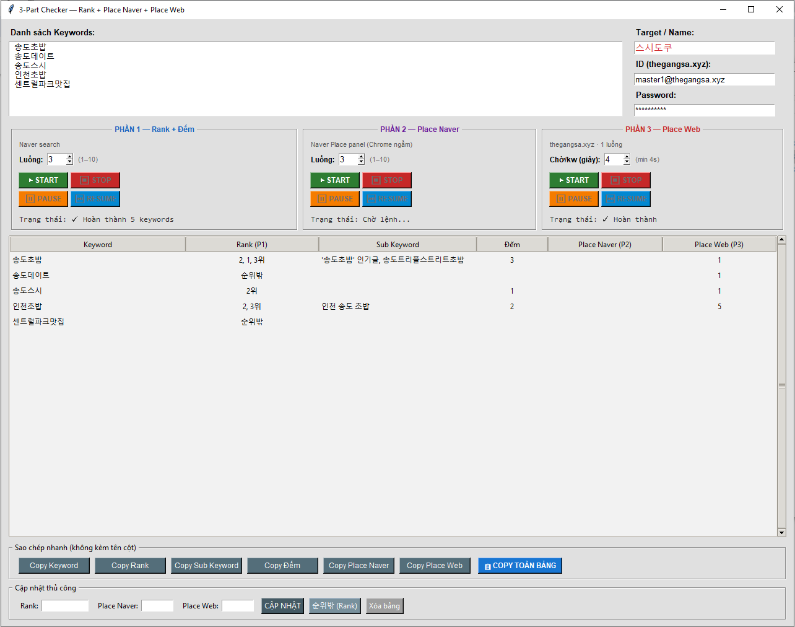

# 📊 Naver Keyword Checker — `main_v4`

> **Tên file:** `main_v4.py` (đổi tên từ `x10_tonghop_v3.py`)  
> **Tiến hóa từ:** `main_v3.py` → `main_v4.py`

---

## 🗂 Mục lục

1. [Tổng quan](#1-tổng-quan)
2. [Cấu trúc thư mục](#2-cấu-trúc-thư-mục)
3. [Ảnh minh họa](#3-ảnh-minh-họa)
4. [Yêu cầu cài đặt](#4-yêu-cầu-cài-đặt)
5. [Chạy nhanh](#5-chạy-nhanh)
6. [Giao diện](#6-giao-diện)
7. [3 Phần chức năng](#7-3-phần-chức-năng)
8. [So sánh v3 → v4](#8-so-sánh-v3--v4-những-gì-đã-thay-đổi)
9. [Luồng xử lý](#9-luồng-xử-lý)
10. [Cấu trúc code](#10-cấu-trúc-code)
11. [Ghi chú & lưu ý](#11-ghi-chú--lưu-ý)

---

## 1. Tổng quan

`main_v4.py` là công cụ kiểm tra thứ hạng từ khóa trên Naver gồm **3 phần độc lập**, mỗi phần có thể chạy **đồng thời** với nhau:

| Phần | Tên | Nguồn dữ liệu | Luồng |
|------|-----|--------------|-------|
| **Phần 1** | Rank + Đếm | Naver Search | 1–10 (tùy chọn) |
| **Phần 2** | Place Naver | Naver Place Panel | 1–10 (tùy chọn) |
| **Phần 3** | Place Web | thegangsa.xyz | Cố định 1 luồng |

---

## 2. Cấu trúc thư mục

```
Search_Tool_N_Statistic/          ← Repository (Public)
├── images/
│   ├── start_v4.png              ← Ảnh giao diện lúc khởi động
│   ├── end_v4.png                ← Ảnh kết quả sau khi chạy xong
│   └── require.png               ← Ảnh file Excel mẫu cần chuẩn bị
├── .gitignore
├── README.md
├── main_v3.py                    ← Phiên bản cũ (tham khảo)
├── main_v4.py                    ← Phiên bản hiện tại ✅
└── requirements.txt
```

---

## 3. Ảnh minh họa

### 📋 Dữ liệu đầu vào — File Excel cần chuẩn bị



---

### 🚀 Giao diện lúc bắt đầu chạy



---

### ✅ Kết quả sau khi hoàn thành



---

## 4. Yêu cầu cài đặt

```bash
pip install selenium webdriver-manager
```

- Python 3.8+
- Google Chrome đã cài sẵn
- `ChromeDriver` được tự động tải bởi `webdriver-manager`

---

## 5. Chạy nhanh

```bash
python main_v4.py
```

Giao diện Tkinter sẽ tự mở. Không cần cấu hình thêm.

---

## 6. Giao diện

```
┌─────────────────────────────────────────────────────────────┐
│  Danh sách Keywords         │  Target / Name:               │
│  [Textbox nhiều dòng]       │  [스시도쿠          ]         │
│                             │  ID (thegangsa.xyz):           │
│                             │  [                 ]          │
│                             │  Password:                    │
│                             │  [*****************]          │
├───────────────┬─────────────┴──────────────────────────────┤
│ PHẦN 1        │ PHẦN 2              │ PHẦN 3                │
│ Rank + Đếm    │ Place Naver         │ Place Web             │
│ Luồng: [3]    │ Luồng: [3]          │ Chờ/kw: [4s]          │
│ ▶START ⏹STOP  │ ▶START ⏹STOP        │ ▶START ⏹STOP          │
│ ⏸PAUSE ⏯RES  │ ⏸PAUSE ⏯RESUME     │ ⏸PAUSE ⏯RESUME       │
│ Trạng thái... │ Trạng thái...       │ Trạng thái...         │
├───────────────┴─────────────────────────────────────────────┤
│ Keyword │ Rank │ Sub Keyword │ Đếm │ Place Naver │ Place Web │
│ ...     │ ...  │ ...         │ ... │ ...         │ ...       │
├─────────────────────────────────────────────────────────────┤
│ [Copy Keyword] [Copy Rank] [Copy Sub Keyword] [Copy Đếm]   │
│ [Copy Place Naver] [Copy Place Web] [📋 COPY TOÀN BẢNG]    │
├─────────────────────────────────────────────────────────────┤
│ Rank:[    ] Place Naver:[  ] Place Web:[  ] [CẬP NHẬT]     │
│                          [순위밖] [Xóa bảng]               │
└─────────────────────────────────────────────────────────────┘
```

---

## 7. 3 Phần chức năng

### Phần 1 — Rank + Đếm (Naver Search)

- Tìm kiếm từng keyword trên `search.naver.com`
- Phân tích DOM để lấy danh sách tiêu đề bài viết theo nhóm block
- Xác định vị trí (thứ hạng) của `Target` trong kết quả
- Tính số lượng xuất hiện (cột **Đếm**)
- Hiển thị thêm **Sub Keyword** — tên nhóm (h2/h3) chứa bài có Target (VD: `인기글`, `최신글`)
- Highlight màu vàng các tiêu đề chứa Target trực tiếp trên trình duyệt
- Hỗ trợ **1–10 luồng song song** (Spinbox)

**Cột kết quả:** `Rank` · `Sub Keyword` · `Đếm`

---

### Phần 2 — Place Naver (Naver Place Panel)

- Tìm kiếm từng keyword, đọc panel **Naver Place** bên phải
- Phân trang qua danh sách địa điểm để tìm vị trí của `Target`
- Chrome chạy ở chế độ **minimize** (ẩn nền)
- Tab/cửa sổ tự đóng sau khi xử lý xong
- Hỗ trợ **1–10 luồng song song**

**Cột kết quả:** `Place Naver`

---

### Phần 3 — Place Web (thegangsa.xyz)

- Đăng nhập tự động vào `thegangsa.xyz` bằng ID/Password đã nhập
- Nhập từng keyword → click "Tìm kiếm chính xác 300" → nhập tên cửa hàng → đọc thứ hạng
- **Cố định 1 luồng** (tránh bị block từ phía web)
- Có thể cấu hình **thời gian chờ giữa các keyword** (min 4 giây, tối đa 120 giây)

**Cột kết quả:** `Place Web`

---

## 8. So sánh v3 → v4 (những gì đã thay đổi)

| Tính năng | `main_v3` | `main_v4` |
|-----------|-----------|-----------|
| Số phần chức năng | 1 phần (Rank) | **3 phần độc lập** |
| Số luồng | Cố định 3 | **Tùy chọn 1–10** mỗi phần |
| Place Naver | ✅ (gộp chung vào 1 luồng) | ✅ **Phần 2 riêng** — có Start/Stop/Pause riêng |
| Place Web (thegangsa.xyz) | ❌ Không có | ✅ **Phần 3 mới hoàn toàn** |
| Sub Keyword (tên nhóm h2/h3) | ❌ Không có | ✅ Cột **Sub Keyword** mới |
| Điều khiển song song | ❌ 1 Start/Stop chung | ✅ **Mỗi phần có Start/Stop/Pause/Resume riêng** |
| Quản lý driver | Queue đơn giản | ✅ **`SectionCtl`** class chuyên biệt |
| Sleep ngắt được | ❌ `time.sleep()` thông thường | ✅ `isleep()` — kiểm tra stop/pause mỗi 0.1s |
| Copy dữ liệu | ❌ Không có | ✅ **Copy từng cột** + **Copy toàn bảng** (TSV) |
| Chỉnh sửa thủ công | ❌ Không có | ✅ **Edit inline** Rank / Place Naver / Place Web |
| Cột bảng | key, place, rank, count, note | **key, rank, subkw, count, p_naver, p_web** |
| Chia keyword theo luồng | Round-robin qua pool | ✅ **`chunk_items()`** — chia liền nhau, phân đều |
| Đóng cửa sổ an toàn | ❌ Không có | ✅ `WM_DELETE_WINDOW` → stop tất cả driver |
| JS lấy tiêu đề | Chỉ trả `titles[]` | ✅ Trả thêm **`subkey`** (tên nhóm) |

---

## 9. Luồng xử lý

### Phần 1 & 2 (đa luồng)

```
[START] → đọc keywords → chia chunk → mở N Chrome
    → ThreadPoolExecutor (N luồng)
        → mỗi luồng xử lý chunk riêng
        → cập nhật bảng UI (root.after)
        → cập nhật tiến độ [T1] x/y  [T2] x/y  ∑ tổng
    → [DONE] → thông báo hoàn thành
```

### Phần 3 (1 luồng)

```
[START] → mở 1 Chrome → đăng nhập thegangsa.xyz
    → lặp từng keyword:
        → nhập kw → click tìm → chờ 5s → nhập tên → đọc rank
        → chờ X giây (isleep — ngắt được)
    → [DONE]
```

### isleep() — Sleep ngắt được

```python
def isleep(self, seconds):
    end = time.time() + seconds
    while time.time() < end:
        if self.stop_event.is_set():
            return False   # bị STOP → thoát ngay
        self.pause_event.wait()  # bị PAUSE → chờ ở đây
        time.sleep(0.1)
    return True
```

---

## 10. Cấu trúc code

```
main_v4.py
├── HẰNG SỐ
│   ├── MAX_THREADS = 10, DEFAULT_THREADS = 3
│   ├── P3_DEFAULT_WAIT = 4  (giây chờ Phần 3)
│   ├── XPATH_PLACE_* (Naver Place panel)
│   └── XG{} (XPath cho thegangsa.xyz)
│
├── SCRIPT_GET_TITLES_GROUPED  (JavaScript inject vào Naver)
│   ├── isValidTitle()         — lọc tiêu đề hợp lệ
│   ├── getSubkey()            — lấy tên nhóm h2/h3 (MỚI)
│   └── trả về [{titles:[], subkey:''}]
│
├── HELPERS
│   ├── find_target_in_groups()  → (list2, subkeys_found)
│   ├── build_list3()            → danh sách rank không trùng
│   ├── compress()               → nén dãy số ("3~7위")
│   ├── calc_count()             → đếm số lần xuất hiện
│   └── chunk_items()            → chia keyword cho N luồng
│
├── SectionCtl  (class quản lý 1 phần)
│   ├── state: idle / running / paused
│   ├── stop_event, pause_event (threading.Event)
│   ├── drivers[], driver_lock
│   ├── thread_progress{}, progress_lock
│   ├── add_driver / remove_driver / kill_drivers
│   ├── pause / resume / stop
│   └── isleep(seconds)
│
└── App  (class UI chính)
    ├── __init__: tạo p1, p2, p3 (SectionCtl)
    ├── _build_ui()
    │   ├── Row 1: Keywords + Target/ID/PW
    │   ├── Row 2: 3 panel điều khiển (p1, p2, p3)
    │   ├── Row 3: Treeview (6 cột)
    │   ├── Row 4: Copy buttons
    │   └── Row 5: Edit thủ công
    ├── _on_start/stop/pause/resume(name)
    ├── _bootstrap_p1/p2/p3()     — khởi chạy từng phần
    ├── _worker_p1/p2/p3()        — logic xử lý từng keyword
    ├── _search_place_p2()        — quét Naver Place panel
    ├── _refresh_p_status(name)   — cập nhật tiến độ UI
    ├── _check_done(name, n)      — kiểm tra hoàn thành
    ├── _copy_col / _copy_table   — copy clipboard
    └── _update_data / _set_outside / _clear_table
```

---

## 11. Ghi chú & lưu ý

- **Phần 1, 2, 3 hoàn toàn độc lập** — có thể Start cả 3 cùng lúc, mỗi phần mở Chrome riêng và dùng dữ liệu keyword riêng.
- **Tăng luồng** (Phần 1/2) sẽ mở thêm Chrome — máy cần đủ RAM (mỗi Chrome ~150–300 MB).
- **Phần 3** cố định 1 luồng vì `thegangsa.xyz` giới hạn tần suất request. Thời gian chờ tối thiểu là 4 giây/keyword.
- Nếu Naver thay đổi DOM, cập nhật lại XPath trong `XPATH_PLACE_*` hoặc selector trong `SCRIPT_GET_TITLES_GROUPED`.
- Nếu `thegangsa.xyz` thay đổi giao diện, cập nhật lại dict `XG{}`.
- Kết quả `순위밖` = từ khóa không nằm trong top kết quả tìm thấy.
- Nút **STOP** sẽ dừng ngay và đóng toàn bộ Chrome của phần đó; không mất dữ liệu đã điền vào bảng.
